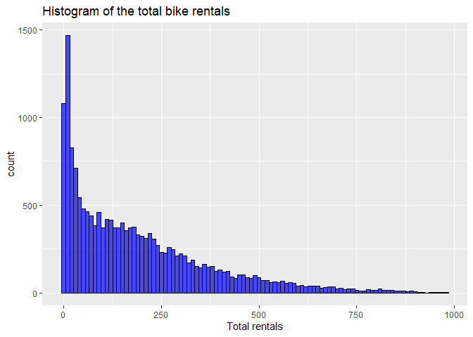

Predicting Bike Rental Demand Using Regression Analysis
================
Annmarie Thomson
2025-1-3

``` r
set.seed(2024)
library(vroom)
library(tidyverse)
```

    ## ── Attaching core tidyverse packages ──────────────────────── tidyverse 2.0.0 ──
    ## ✔ dplyr     1.1.4     ✔ readr     2.1.5
    ## ✔ forcats   1.0.0     ✔ stringr   1.5.1
    ## ✔ ggplot2   3.5.1     ✔ tibble    3.2.1
    ## ✔ lubridate 1.9.4     ✔ tidyr     1.3.1
    ## ✔ purrr     1.0.2     
    ## ── Conflicts ────────────────────────────────────────── tidyverse_conflicts() ──
    ## ✖ readr::col_character()   masks vroom::col_character()
    ## ✖ readr::col_date()        masks vroom::col_date()
    ## ✖ readr::col_datetime()    masks vroom::col_datetime()
    ## ✖ readr::col_double()      masks vroom::col_double()
    ## ✖ readr::col_factor()      masks vroom::col_factor()
    ## ✖ readr::col_guess()       masks vroom::col_guess()
    ## ✖ readr::col_integer()     masks vroom::col_integer()
    ## ✖ readr::col_logical()     masks vroom::col_logical()
    ## ✖ readr::col_number()      masks vroom::col_number()
    ## ✖ readr::col_skip()        masks vroom::col_skip()
    ## ✖ readr::col_time()        masks vroom::col_time()
    ## ✖ readr::cols()            masks vroom::cols()
    ## ✖ readr::date_names_lang() masks vroom::date_names_lang()
    ## ✖ readr::default_locale()  masks vroom::default_locale()
    ## ✖ dplyr::filter()          masks stats::filter()
    ## ✖ readr::fwf_cols()        masks vroom::fwf_cols()
    ## ✖ readr::fwf_empty()       masks vroom::fwf_empty()
    ## ✖ readr::fwf_positions()   masks vroom::fwf_positions()
    ## ✖ readr::fwf_widths()      masks vroom::fwf_widths()
    ## ✖ dplyr::lag()             masks stats::lag()
    ## ✖ readr::locale()          masks vroom::locale()
    ## ✖ readr::output_column()   masks vroom::output_column()
    ## ✖ readr::problems()        masks vroom::problems()
    ## ℹ Use the conflicted package (<http://conflicted.r-lib.org/>) to force all conflicts to become errors

``` r
library(tidymodels)
```

    ## ── Attaching packages ────────────────────────────────────── tidymodels 1.3.0 ──
    ## ✔ broom        1.0.7     ✔ rsample      1.2.1
    ## ✔ dials        1.4.0     ✔ tune         1.3.0
    ## ✔ infer        1.0.7     ✔ workflows    1.2.0
    ## ✔ modeldata    1.4.0     ✔ workflowsets 1.1.0
    ## ✔ parsnip      1.3.0     ✔ yardstick    1.3.2
    ## ✔ recipes      1.1.1     
    ## ── Conflicts ───────────────────────────────────────── tidymodels_conflicts() ──
    ## ✖ scales::discard() masks purrr::discard()
    ## ✖ dplyr::filter()   masks stats::filter()
    ## ✖ recipes::fixed()  masks stringr::fixed()
    ## ✖ dplyr::lag()      masks stats::lag()
    ## ✖ yardstick::spec() masks readr::spec(), vroom::spec()
    ## ✖ recipes::step()   masks stats::step()

``` r
library(ggplot2)
library(ucimlrepo)
library(leaps)
library(mltools)
```

    ## 
    ## Attaching package: 'mltools'
    ## 
    ## The following objects are masked from 'package:yardstick':
    ## 
    ##     mcc, rmse
    ## 
    ## The following object is masked from 'package:tidyr':
    ## 
    ##     replace_na

``` r
library(ggpubr)
```

## Predicting Bike Rental Demand Using Regression Analysis

### Summary

In our project, we will attempt to build a regression model using best
subset selection to analyze bike-sharing data to predict rental demand.
We will examine factors like weather, time, and holidays to understand
their influence on bike usage.

### Introduction

Bike-sharing systems are a growing component of urban design (Winters,
2020), providing an eco-friendly, convenient, and healthy alternative to
traditional transient or driving. Building understanding around the
factors that drive bike-share demand can help urban designers improve
bike services. The dataset we used to form our regression is the Bike
Sharing Dataset (dataset ID: 275) from the UCI Machine Learning
Repository, which you can find at
<https://archive.ics.uci.edu/dataset/275/bike+sharing+dataset>. It
contains information on bike rentals, weather, and time-related
features. Our research question: How do environmental and temporal
factors affect bike-sharing demand?

### Methods and Results

| Predictor Variable | Description |
|----|----|
| season | Season that the bike is rented in |
| holiday | If the day the bike was rented is a holiday |
| workingday | If the day the bike was rented is a work day |
| weathersit | What the weather was on the day the bike was rented |
| temp | What the temperature was on the day the bike was rented |
| hum | What the humidity was on the day the bike was rented |
| windspeed | What the windsped was on the day the bike was rented |

**Table 1.** Predictor variables used for analysis

Our dataset was loaded and cleaned by ensuring correct factorization and
removing irrelevant columns. We had no missing data or special
characters so we did not have to worry about that.

``` r
bike <- fetch_ucirepo(id = 275)
bike_data <- bike$data$original
bike_data <- bike_data %>%
  select(-instant, -dteday)
bike_data <- bike_data %>%
  mutate(weathersit = as.factor(weathersit))
bike_data <- bike_data %>%
  mutate(cnt = as.numeric(cnt))
write_csv(bike_data, "../dsci-310-group-16/data/bike_data.csv")
```

In our exploratory analysis, we looked to see how dependent variables
affected bike rental usage. We also made a correlation matrix to explore
how correlated our variables are. We found multicollinearity between
atemp and temp, so moving forward we will use temp in our analysis.
Finally, we found that the distribution of bike rental counts was
heavily right skewed. Because we plan to use linear regression and we
want to maintain the assumption of normality, moving forward we will be
using a log transformation on the cnt variable.

``` r
total_rentals = ggplot(bike_data,aes(x = cnt))+
geom_histogram(binwidth = 10, fill = "blue",color = "black",alpha = 0.7)+
labs(title = "Histogram of the total bike rentals", x = "Total rentals")

temp_vs_rentals = ggplot(bike_data, aes(x = temp, y = cnt)) +
  geom_point(color = "blue", alpha = 0.5) +
  theme_minimal() +
  labs(title = "Temperature vs Bike Rentals", x = "Temperature", y = "Total Bike Rentals")


weather_vs_cnt = ggplot(bike_data, aes(x = factor(weathersit), y = cnt, fill = factor(weathersit))) +
  geom_bar(stat = "identity") +
  scale_x_discrete(labels=c("Clear/Partly Cloudy", "Mist and Cloudy", "Light Percipitation", "Heavy Percipitation")) +
  labs(title = "Bike Rentals by \nWeather Situation", x = "Weather Situation", y = "Total Bike Rentals") +
  theme(axis.text.x = element_text(angle = 70, vjust = 0.5))


season_vs_cnt = ggplot(bike_data, aes(x = factor(season), y = cnt)) +
  geom_boxplot(fill = "lightgreen", color = "black", alpha = 0.7) +
  labs(title = "Bike Rentals by Season", x = "Season", y = "Total Bike Rentals")

weekday_rental = ggplot(bike_data, aes(x = factor(weekday), y = cnt, fill = factor(weekday))) +
  geom_bar(stat = "identity", show.legend = FALSE) +
  scale_fill_viridis_d() +
  scale_x_discrete(labels=c("Sunday", "Monday", "Tuesday", "Wednesday", "Thursday", "Friday", "Saturday")) +
  labs(title = "Bike Rentals by Weekday", x = "Weekday", y = "Total Bike Rentals") +
  theme(axis.text.x = element_text(angle = 70, vjust = 0.5))

humidty_rental = ggplot(bike_data, aes(x = hum, y = cnt)) +
  geom_point(color = "purple", alpha = 0.5) +
  labs(title = "Humidity vs Bike Rentals", x = "Humidity", y = "Total Bike Rentals") +
  theme(axis.text.x = element_text(angle = 70, vjust = 0.5))

wind_rental = ggplot(bike_data, aes(x = windspeed, y = cnt)) +
  geom_point(color = "green", alpha = 0.5) +
  theme_minimal() +
  labs(title = "Windspeed vs Bike Rentals", x = "Wind Speed", y = "Total Bike Rentals")


ggarrange(temp_vs_rentals, weather_vs_cnt, season_vs_cnt, weekday_rental, humidty_rental, wind_rental)
```

<!-- -->

**Figure 1.** Distributions of dependent variables vs bike rental counts

``` r
total_rentals
```

<!-- -->

**Figure 2.** Distribution of bike rental counts

``` r
cor(bike_data %>% select(temp, atemp, hum, windspeed, casual, registered, cnt))
```

    ##                   temp       atemp         hum   windspeed      casual
    ## temp        1.00000000  0.98767214 -0.06988139 -0.02312526  0.45961565
    ## atemp       0.98767214  1.00000000 -0.05191770 -0.06233604  0.45408007
    ## hum        -0.06988139 -0.05191770  1.00000000 -0.29010490 -0.34702809
    ## windspeed  -0.02312526 -0.06233604 -0.29010490  1.00000000  0.09028678
    ## casual      0.45961565  0.45408007 -0.34702809  0.09028678  1.00000000
    ## registered  0.33536085  0.33255864 -0.27393312  0.08232085  0.50661770
    ## cnt         0.40477228  0.40092930 -0.32291074  0.09323378  0.69456408
    ##             registered         cnt
    ## temp        0.33536085  0.40477228
    ## atemp       0.33255864  0.40092930
    ## hum        -0.27393312 -0.32291074
    ## windspeed   0.08232085  0.09323378
    ## casual      0.50661770  0.69456408
    ## registered  1.00000000  0.97215073
    ## cnt         0.97215073  1.00000000

**Figure 3.** Correlation matrix of prediction variables

The data was split into training (75%) and testing (25%) sets,
stratified by cnt (total bike counts). To ensure we had enough data
representation in the test set, we computed the median, mean, and
standard deviation for both data sets to make sure they were similar.

``` r
bike_split <- initial_split(bike_data, prop = 0.75, strata = cnt)
bike_train <- training(bike_split)
bike_test <- testing(bike_split)

bike_train_summary <- bike_train |> 
    summarize(median_cnt = median(cnt, na.rm = TRUE),
             mean_cnt = mean(cnt, na.rm = TRUE),
             standard_deviation_cnt = sd(cnt, na.rm = TRUE))

bike_test_summary <- bike_test |> 
    summarize(median_cnt = median(cnt, na.rm = TRUE),
             mean_cnt = mean(cnt, na.rm = TRUE),
             standard_deviation_cnt = sd(cnt, na.rm = TRUE))

bike_tt_summary <- bind_rows(bike_train_summary, bike_test_summary) |>
    mutate(partition = c("Train", "Test"),
           fraction = c(0.8, 0.2))|> 
    relocate(partition, fraction)
bike_tt_summary
```

    ##   partition fraction median_cnt mean_cnt standard_deviation_cnt
    ## 1     Train      0.8        142 189.8049               181.6294
    ## 2      Test      0.2        142 188.4385               180.6777

**Table 2.** Summary statistics for response variable (cnt) for each
data split.

To determine the most appropriate model, we used the best subset
framework. Because weather is a categorical variable, we needed to check
if the model with or without weather did better to determine our final
model.

``` r
best_models <- regsubsets(log(cnt)~ season + holiday + workingday + weathersit + temp + hum + windspeed, data = bike_train, nvmax = 11)

res.sum <- summary(best_models)

data.frame(
  R2 = which.max(res.sum$rsq),
  Adj.R2 = which.max(res.sum$adjr2)
)
```

    ##   R2 Adj.R2
    ## 1  9      9

**Table 3.** Model with largest R<sup>2</sup> and adjusted R<sup>2</sup>

We created two linear regression models with and without weather
respecively to assess their impact on bike demand. Because the model
that included weather had a higher adjusted R<sup>2</sup> , we decided
to use that model as our final regression model.

``` r
bike_model_with_weather = lm(log(cnt) ~ season + holiday + workingday + weathersit + temp + hum + windspeed, data = bike_train)
res_with <- summary(bike_model_with_weather)
bike_model_no_weather = lm(log(cnt) ~ season + holiday + workingday + temp + hum + windspeed, data = bike_train)
res_no <- summary(bike_model_no_weather)
data.frame(
  Adj.R2_with = res_with$adj.r.squared,
  Adj.R2_without = res_no$adj.r.squared
)
```

    ##   Adj.R2_with Adj.R2_without
    ## 1    0.264065      0.2578714

**Table 4.** Comparing model with and without weather

``` r
final_bike_model = bike_model_with_weather
tidy(final_bike_model)
```

    ## # A tibble: 10 × 5
    ##    term        estimate std.error statistic   p.value
    ##    <chr>          <dbl>     <dbl>     <dbl>     <dbl>
    ##  1 (Intercept)   4.40      0.0633     69.5  0        
    ##  2 season        0.162     0.0109     14.9  1.34e- 49
    ##  3 holiday      -0.204     0.0681     -3.00 2.70e-  3
    ##  4 workingday   -0.0595    0.0249     -2.39 1.70e-  2
    ##  5 weathersit2   0.283     0.0271     10.4  2.69e- 25
    ##  6 weathersit3   0.0748    0.0450      1.66 9.66e-  2
    ##  7 weathersit4   1.57      0.902       1.74 8.11e-  2
    ##  8 temp          2.55      0.0619     41.2  0        
    ##  9 hum          -2.65      0.0686    -38.7  1.01e-309
    ## 10 windspeed     0.502     0.0978      5.14 2.85e-  7

**Table 5.** Final model summary

To assess the model fit, we generated a residual plot. This plot
indicates that even with our log transformation, the residuals are a bit
heteroscedastic, and in future renditions of this project we plan to
adopt a different, more appropriate model.

``` r
ggplot(bike_train,aes(x= fitted(final_bike_model),y = residuals(final_bike_model)))+
geom_point(alpha = 0.5)+
geom_hline(yintercept = 0,linetype = 'dashed',color = "red")+
labs(title = "Residual plot", x = "Fitted values", y = "Residuals")
```

<!-- -->

**Figure 4.** Residual plot of final model

Finally, to evaluate prediction accuracy we calculated RMSE, which we
found to be 1.29 uses approximately, suggesting the model prediction is
good and our model is useful.

``` r
predictions = predict(final_bike_model, newdata = bike_test)
RMSE = rmse(preds = predictions, actuals = log(bike_test$cnt))
data.frame(RMSE)
```

    ##       RMSE
    ## 1 1.271976

**Table 6.** RMSE of our linear model

### Discussion

We found that the ideal model for our data includes season, holiday
status, wether it is a working day, the temperature, the humidity, and
the wind speed. We found that our model became stronger with the
inclusion of weather-related variables. Though none of these findins are
individually surprising, we were surprised that all of the variables had
an impact on bike demand prediction and wonder if more research can be
done into what other variables may also be used in this model. These
findings suggest that these variables can significantly influence bike
demand, information that can be used to help increase total users.

Future Questions:

Could a non-linear model be more accurate in terms of prediction?

How do long-term weather trends affect the seasonal bike usage?

What other outside variables are impactful in the prediction of
bike-share usage?

### **Citations**

Teschke, K. (n.d.). *Bike share*. Cycling in Cities.
<https://cyclingincities.spph.ubc.ca/motivating-cycling/bikeshare-systems/>

R Core Team. 2019. R: *A Language and Environment for Statistical
Computing.* Vienna, Austria: R Foundation for Statistical Computing.
[https://www.R-project.org/](https://www.r-project.org/).

Wickham H (2016). *ggplot2: Elegant Graphics for Data Analysis*.
Springer-Verlag New York. ISBN
978-3-319-24277-4, [https://ggplot2.tidyverse.org](https://ggplot2.tidyverse.org/).

Fanaee-T, H. (2013). *Bike Sharing \[Dataset\]*. UCI Machine Learning
Repository. <https://doi.org/10.24432/C5W894>.
