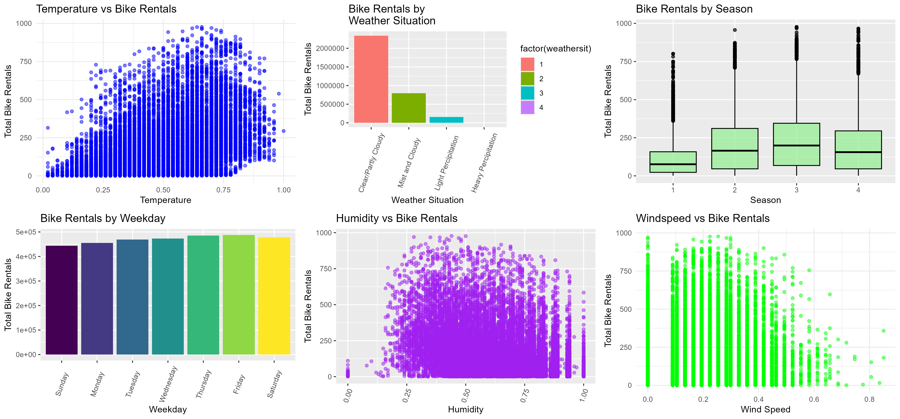
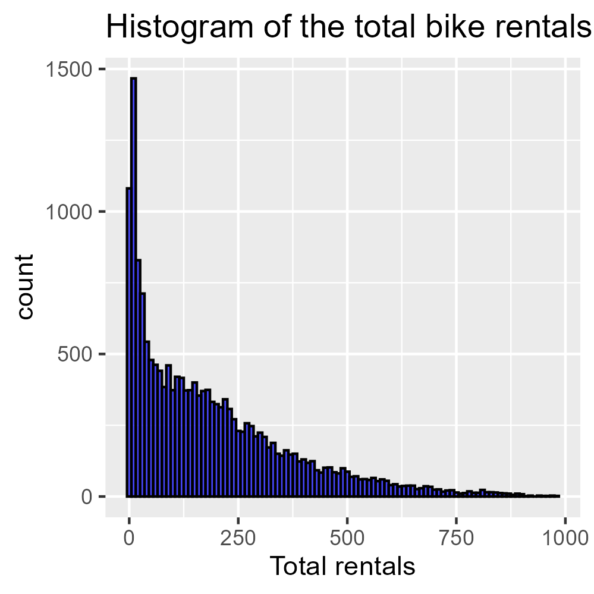
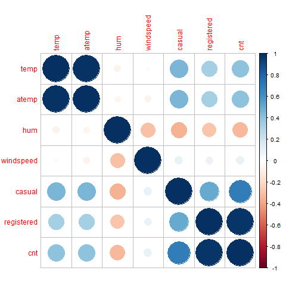
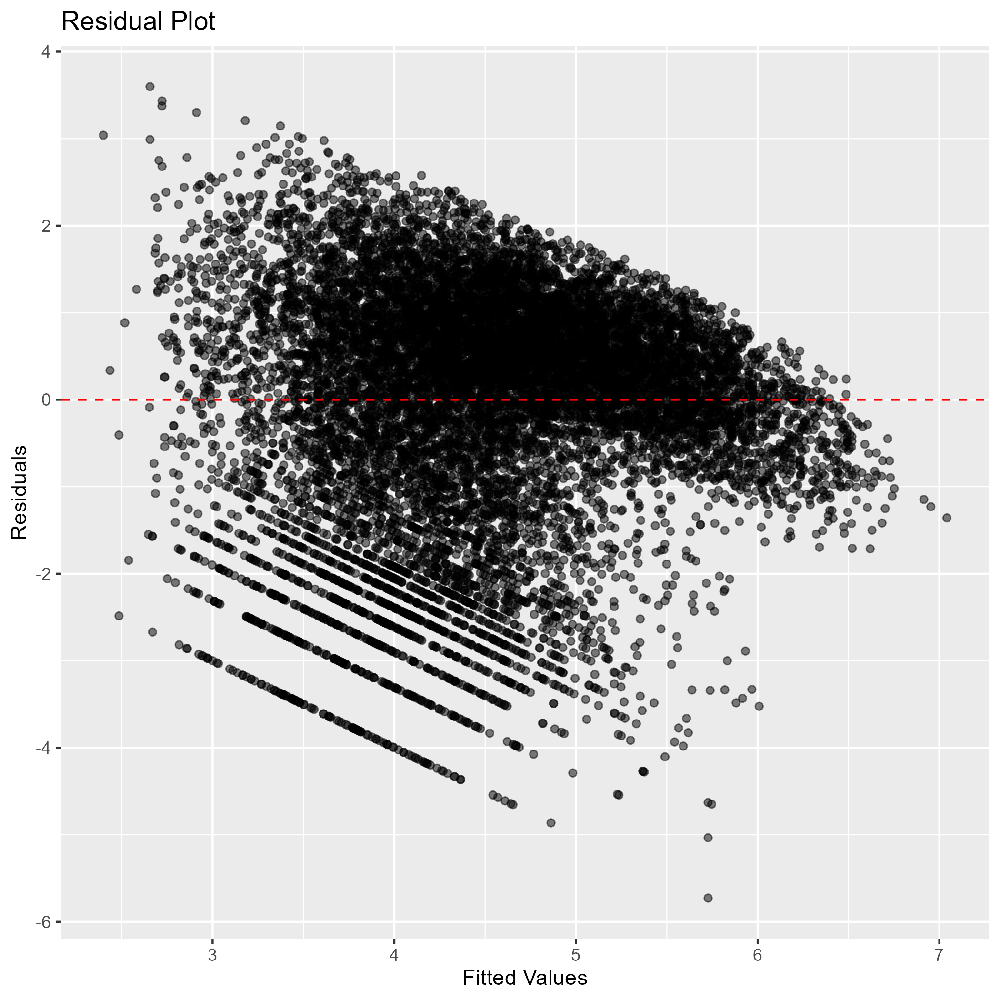

## Predicting Bike Rental Demand Using Regression Analysis

### Summary

In our project, we will attempt to build a regression model using best subset selection to analyze bike-sharing data to predict rental demand. We will examine factors like weather, time, and holidays to understand their influence on bike usage.

### Introduction

Bike-sharing systems are an integral part of urban transportation (Winters, 2020). Understanding the factors driving bike-share demand can help urban planners optimize services.  The dataset we used to form our regression is the **Bike Sharing Dataset** (dataset ID: 275) from the [UCI Machine Learning Repository](https://archive.ics.uci.edu/dataset/275/bike+sharing+dataset)(@bike_sharing_275). It contains information on bike rentals, weather conditions, and time-related features. Our research question: **To what extent can weather and timporal factors predict bike rental demand?**

### Software & Packages
The R programming language (@R) and the following R packages were used to perform the analysis: 
knitr (@knitr), tidyverse (@tidyverse), tidymodels (@tidymodels), ggplot2 (@ggplot2), ucimlrepo (@ucimlrepo), leaps (@leaps), mltools (@mltools), and ggpubr (@ggpubr). 


### Methods and Results

```{r, echo=FALSE}
data.frame(
  Predictor_Variable = c("season", "holiday", "workingday", "weathersit", "temp", "hum", "windspeed"),
  Description = c(
    "Season that the bike is rented in",
    "If the day is a holiday",
    "If the day is a workday",
    "What the weather was on the day the bike was rented ",
    "What the temperature was on the day the bike was rented",
    "What the humidity was on the day the bike was rented",
    "What the windsped was on the day the bike was rented"
  )
) |> knitr::kable(caption = "Predictor variables used for analysis")
```

Our dataset was loaded and cleaned by ensuring correct factorization and removing irrelevant columns. We had no missing data or special characters so we did not have to worry about that.

```{r read and clean data}
# Load required packages
library(tidyverse)  # This includes dplyr, ggplot2, tidyr, readr, etc.

# Define dataset URL
bike_url <- "https://archive.ics.uci.edu/ml/machine-learning-databases/00275/Bike-Sharing-Dataset.zip"

# Define file paths
zip_path <- "../dsci-310-group-16/data/bike_data.zip"
csv_output_path <- "../dsci-310-group-16/data/bike_data.csv"

# Download the ZIP file if it doesn't exist
if (!file.exists(zip_path)) {
  download.file(bike_url, zip_path)
}

# Extract ZIP file (only if not extracted)
unzip(zip_path, exdir = "../dsci-310-group-16/data")

# Read the dataset (use `hour.csv` instead for hourly data)
bike_data <- read.csv("../dsci-310-group-16/data/day.csv")

# Ensure dplyr pipes (%>%) work
bike_data <- bike_data %>%
  select(-instant, -dteday) %>%
  mutate(
    weathersit = as.factor(weathersit),
    cnt = as.numeric(cnt)
  )

# Save cleaned data
write_csv(bike_data, csv_output_path)

# Print first few rows to confirm
head(bike_data)
```

In our exploratory analysis, we looked to see how dependent variables affected bike rental usage. We also made a correlation matrix to explore how correlated our variables are. We found multicollinearity between atemp and temp, so moving forward we will use temp in our analysis. Finally, we found that the distribution of bike rental counts was heavily right skewed. Because we plan to use linear regression and we want to maintain the assumption of normality, moving forward we will be using a log transformation on the cnt variable.

{#fig-exploratory_analysis width=80%}
**@fig-exploratory_analysis**: Distributions of dependent variables vs bike rental counts

{#fig-total_rentals width=50%}
**@fig-total_rentals**: Distribution of bike rental counts

{#fig-correlation width=50%}
**@fig-correlation**: Correlation matrix of prediction variables

The data was split into training (75%) and testing (25%) sets, stratified by cnt (total bike counts). To ensure we had enough data representation in the test set, we computed the median, mean, and standard deviation for both data sets to make sure they were similar.

```{r best subset}
bike_split <- initial_split(bike_data, prop = 0.75, strata = cnt)
bike_train <- training(bike_split)
bike_test <- testing(bike_split)

bike_train_summary <- bike_train |> 
    summarize(median_cnt = median(cnt, na.rm = TRUE),
             mean_cnt = mean(cnt, na.rm = TRUE),
             standard_deviation_cnt = sd(cnt, na.rm = TRUE))

bike_test_summary <- bike_test |> 
    summarize(median_cnt = median(cnt, na.rm = TRUE),
             mean_cnt = mean(cnt, na.rm = TRUE),
             standard_deviation_cnt = sd(cnt, na.rm = TRUE))

bike_tt_summary <- bind_rows(bike_train_summary, bike_test_summary) |>
    mutate(partition = c("Train", "Test"),
           fraction = c(0.8, 0.2))|> 
    relocate(partition, fraction)
bike_tt_summary

```

**Table 2.** Summary statistics for response variable (cnt) for each data split.

To determine the most appropriate model, we used the best subset framework. Because weather is a categorical variable, we needed to check if the model with or without weather did better to determine our final model.

```{r}
best_models <- regsubsets(log(cnt)~ season + holiday + workingday + weathersit + temp + hum + windspeed, data = bike_train, nvmax = 11)

res.sum <- summary(best_models)

data.frame(
  R2 = which.max(res.sum$rsq),
  Adj.R2 = which.max(res.sum$adjr2)
)
```

**Table 3.** Model with largest R^2^ and adjusted R^2^

We created two linear regression models with and without weather respecively to assess their impact on bike demand. Because the model that included weather had a higher adjusted R^2^ , we decided to use that model as our final regression model.

```{r}
bike_model_with_weather = lm(log(cnt) ~ season + holiday + workingday + weathersit + temp + hum + windspeed, data = bike_train)
res_with <- summary(bike_model_with_weather)
bike_model_no_weather = lm(log(cnt) ~ season + holiday + workingday + temp + hum + windspeed, data = bike_train)
res_no <- summary(bike_model_no_weather)
data.frame(
  Adj.R2_with = res_with$adj.r.squared,
  Adj.R2_without = res_no$adj.r.squared
)

```

**Table 4.** Comparing model with and without weather

```{r}
final_bike_model = bike_model_with_weather
tidy(final_bike_model)
```

**Table 5.** Final model summary

To assess the model fit, we generated a residual plot. This plot indicates that even with our log transformation, the residuals are a bit heteroscedastic, and in future renditions of this project we plan to adopt a different, more appropriate model.

{#fig-residual_plot width=60%}

**@fig-residual_plot**: Residual plot of final model.

Finally, to evaluate prediction accuracy we calculated RMSE, which we found to be 1.29 uses approximately, suggesting the model prediction is good and our model is useful.

```{r}
predictions = predict(final_bike_model, newdata = bike_test)
RMSE = rmse(preds = predictions, actuals = log(bike_test$cnt))
data.frame(RMSE)
```

**Table 6.** RMSE of our linear model

### Discussion

We found that the ideal model for our data includes season, holiday status, wether it is a working day, the temperature, the humidity, and the wind speed. We found that our model became stronger with the inclusion of weather-related variables. Though none of these findins are individually surprising, we were surprised that all of the variables had an impact on bike demand prediction and wonder if more research can be done into what other variables may also be used in this model. These findings suggest that these variables can significantly influence bike demand, information that can be used to help increase total users.

Future Questions:

Could a non-linear model be more accurate in terms of prediction?

How do long-term weather trends affect the seasonal bike usage?

What other outside variables are impactful in the prediction of bike-share usage?

### Reference